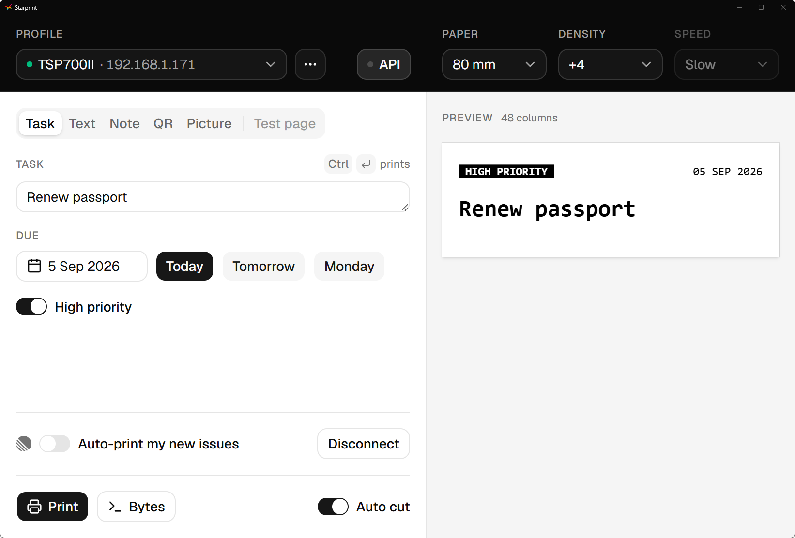
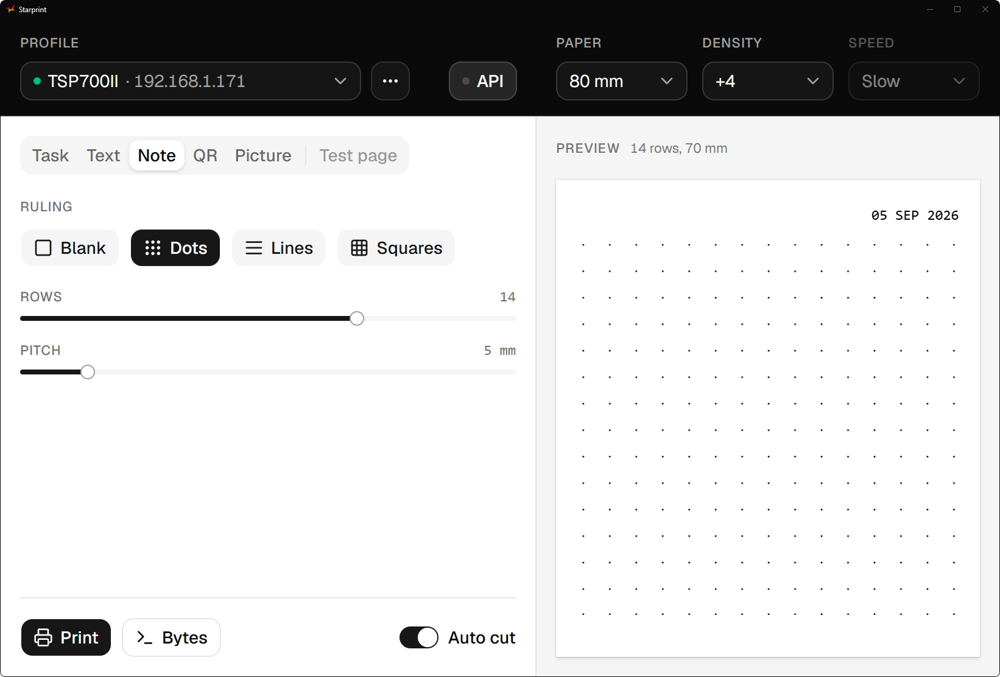
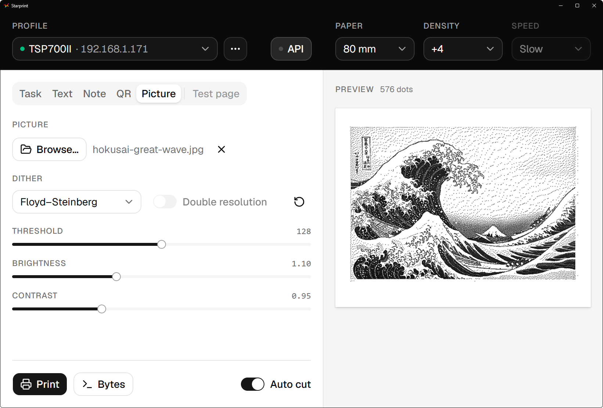

<p align="center">
  
</p>

<h1 align="center">starprint</h1>

<p align="center">A desktop app and Rust library for Star Micronics receipt printers.</p>

<p align="center">
  <a href="https://github.com/bcsongor/starprint-rs/releases/latest"></a>
  <a href="https://github.com/bcsongor/starprint-rs/actions/workflows/ci.yml"></a>
</p>

<p align="center">
  <a href="docs/images/desktop-app.png"></a><br>
  <strong>Task card</strong>
</p>

## Get started

[Download the latest release](https://github.com/bcsongor/starprint-rs/releases/latest)
for Windows or macOS on Apple silicon. Windows has an installer and a portable
executable. The builds are unsigned; the release page has installation instructions.

Connect your printer over Ethernet, then open **Profile actions** beside the
profile picker and choose **Edit…** to enter its IP address. Choose a job, check
the preview and press **Print**.

Tested on the TSP700II, TSP800II and SP700. Other thermal printers using Star
Line Mode may work. StarPRNT, USB and serial connections are not supported.

## Print jobs

The desktop app and HTTP API support **task cards**, **text**, **note slips**,
**QR codes**, **pictures** and **test pages**. The app previews each job before you print.

<table align="center">
  <tr>
    <td align="center">
      <a href="docs/images/note-slip.png"></a><br>
      <strong>Note slip</strong>
    </td>
    <td align="center">
      <a href="docs/images/picture.png"></a><br>
      <strong>Picture</strong>
    </td>
  </tr>
</table>

<p align="center">
  <sub>Picture artwork: Hokusai, <a href="https://www.metmuseum.org/art/collection/search/56353">The Great Wave</a>, public domain.</sub>
</p>

<table align="center">
  <tr>
    <td align="center">
      <video src="https://github.com/user-attachments/assets/e7cf5cbc-501d-43bd-81d0-044b4f7379ab" controls></video>
      <p><strong>Task card and picture printing</strong></p>
    </td>
  </tr>
</table>

## Automate printing

Turn Linear issues into printed task cards. Connect with a personal API key,
then enable auto-print for issues newly assigned to you while the app runs.

Print any job on a timetable. Set it up under its tab, press **Schedule**, and
pick a preset such as every weekday at nine or write a cron expression. The
clock button in the header lists the schedules and switches them on and off.
They run while the app is open; a run missed while it was closed prints once
at the next start. A scheduled task card is dated the day it prints.

The **API** button lets scripts and AI agents print through your saved profiles.
It shows the URL and the token every request needs, and lets you choose the
address and port to listen on. See the
[API reference](skills/starprint-print/SKILL.md) for jobs and setup, including
running the server on its own.

## Rust library

Build print jobs in your own code and send them over Ethernet.

```toml
[dependencies]
starprint = { git = "https://github.com/bcsongor/starprint-rs" }
```

For a Star Line Mode thermal printer:

```rust
use starprint::{Cut, transport::TcpTransport};

fn main() -> Result<(), starprint::Error> {
	let document = starprint::starline()
		.line("Hello, paper.")
		.cut(Cut::FeedThenPartial)
		.build();

	TcpTransport::connect("192.168.1.60")?.print(&document)
}
```

Use your printer's IP address. Add `features = ["image"]` for photos.
See the [library reference](crates/starprint/src/lib.rs) and [examples](crates/starprint/examples).

## Build the app from source

Install Rust, Bun and the [Tauri prerequisites](https://v2.tauri.app/start/prerequisites/),
then run these commands from the repository root:

```sh
bun run gui-setup
bun run gui
```

Build an installer with `bun --cwd apps/starprint-gui tauri build`.
See [CONTRIBUTING.md](CONTRIBUTING.md) for development and printer reports.

## Licence

MIT or Apache-2.0, at your option.

Starprint is an independent project, not affiliated with or endorsed by
Star Micronics. Star Micronics and its printer names are Star's marks, used
here to identify compatible hardware. The [Star manuals](manuals/README.md)
the code implements are Star's copyright and are not included.
